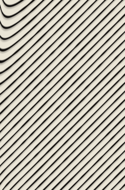
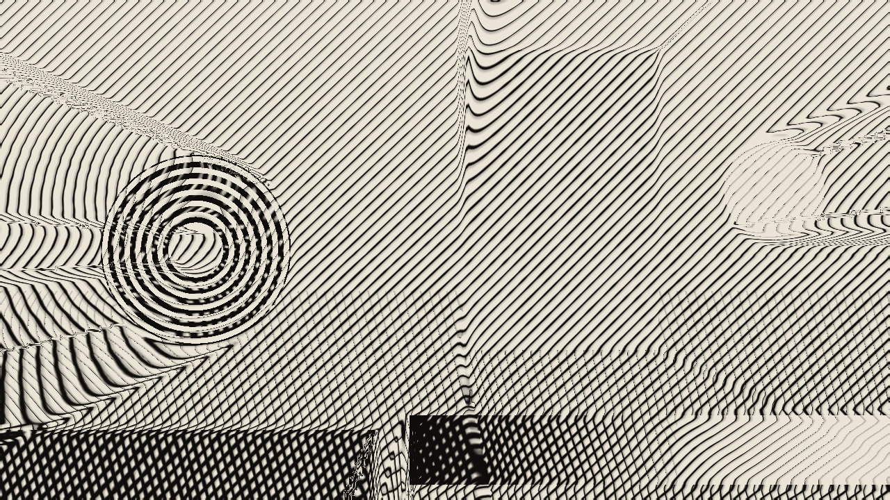

# intaglio

> **AI-assisted project.** This codebase was created with [Claude](https://claude.com/claude-code)
> (Anthropic), directed and reviewed by a human author. It has **never been
> loaded into Resolume on macOS** — everything below is measured by an offline harness
> that drives the real plugin class in a headless GL context. The central
> claims are not asserted but measured: `igtest --pitch` counts the lines a
> flat field is ruled with against width over pitch, `igtest --weight` compares
> the mean ink coverage at five tones against the weight curve, `igtest
> --limits` requires the plate to go solid at the dark end and bare at the
> light end, and `igtest --perpendicular` and `--crosshatch` measure the angles
> the lines actually come out at. Every one of those runs at **two rasters**
> and fails if the two disagree, and `igtest --negative` re-runs all of them
> against a deliberately wrong model and fails if any of them *passes* (see
> [Status](#status)). A control sweep fails if any parameter turns out to do
> nothing.

Engraving for Resolume Arena/Avenue, as an FFGL effect. An engraver cannot
choose a grey — the plate has lines, and tone is made by how close together
they are and how fat each one is.

## The one idea

**Tone is carried by the line, not by the pixel.** A line *swells* where the
tone darkens and tapers where it lightens; at the dark limit it is as wide as
the pitch and the plate goes solid, and at the light limit it tapers to
nothing and leaves bare paper. Cross-hatching adds a second and a third set at
other angles when one set runs out of range.

What falls out of that, rather than being arranged:

- **The shading of an engraving.** Nothing here draws a grey; the greys are
  what a ruled line does when you look at it from far enough away.
- **Detail survives in the darks as line weight rather than as mud**, because
  the lines only close up where the model says the coverage has actually
  reached one.
- **The moiré where two hatch sets cross** — which is a real thing a real
  plate does, and which this one does for the same reason.

And the lines obey the picture, because they follow a flow field built from
the structure tensor of the tone — the same field [nib](https://github.com/stoatworks-labs/nib)
uses, copied from it rather than derived a second time.

## This is not nib

nib draws the **edges**. Intaglio draws the **tone** — lines everywhere, whose
spacing and weight carry the shading, which happen to *obey* the edges because
they follow the same flow field.

The test that separates them is a flat grey area. nib draws nothing there,
because there is no edge. Intaglio has to fill it with evenly spaced lines of
the pitch and weight that grey calls for:

A crop of the flat panel on the harness's test card — a region with no
edge anywhere inside it. Rendered by `igtest --crop`, not captured from
Resolume.

The whole card. The rings on the left are the analytic part — their
tangent is known in closed form, which is what makes the flow field a
measurement. The flat panel is the crop above; the strip along the bottom is a
tone ramp through every weight the curve can ask for. Rendered by the plugin's
own offline harness (`igtest`).

## Controls

- **Flow** — Detect On (which channel carries the picture; a red line on a blue
  field has enormous chroma contrast and almost no luminance contrast, so
  Saturation is not an exotic setting), Detail (the scale the structure is read
  at), Flow Smoothing, Coherence, Angle Offset. **Coherence at zero ignores the
  picture's structure entirely** and rules a plain global hatch at Angle
  Offset, which is what this effect would be without the idea in it. That A/B
  is one control away on purpose.
- **Line** — Line Pitch (the ruling, in lines across the frame, not in pixels),
  Weight Curve, Min Weight, Max Weight, Taper. Min and Max Weight are the two
  ends of the claim: at Max Weight 1 a black input makes the plate solid, and
  at Min Weight 0 a white input leaves bare paper.
- **Cross-hatch** — Sets (1/2/3), Cross Angle, Engage Threshold, Engage
  Softness. The second set arrives progressively below the threshold, so it
  comes in with the shadows rather than switching on.
- **Plate** — Ink, Paper, Plate Tone (the veil a wiped plate keeps), Bite (how
  irregular the etch is), Burr (the curl of metal a drypoint needle throws up
  on one side of the furrow, which holds extra ink — it is what tells a
  drypoint from an engraving across a room).
- **Output** — Mix, Invert. Invert makes a *white-line* engraving: the burin
  cuts the highlights instead of the shadows. It is not a colour swap — the
  lines still follow the picture's own structure, so what comes out is a
  different drawing rather than the same one photographed as a negative.

Every length is a fraction of the frame height rather than a number of pixels,
so the same settings give the same drawing at 720p and at 4K. That is checked
rather than claimed: the measurements run at two rasters and fail if they
disagree.

## Status

**v0.1.0 (built 2026-09-22), released 2026-09-23, and honestly early.**

User guide: [docs/USER-GUIDE.md](docs/USER-GUIDE.md), also at https://stoatworks-labs.com/software/intaglio/guide/

It has **never been loaded into Resolume on macOS**. Everything here is the offline
harness, which drives the real plugin class headlessly; `oxbow probe` reads the
bundle the way a host does and finds `SW Intaglio` / `IG01` / effect; on macOS
nothing has instantiated it. There is no OpenFX port, no browser demo, no
`--pipe`/`--script`, and no factory presets. The render cost is measured on
macOS (Apple Silicon) only: **0.59 ms/frame at 720p, 1.19 at 1080p,
4.57 at 4K** (medians of three runs; the 720p figure jitters between 0.59
and 0.75). The universal build has never run on an Intel Mac.

The checks have run on a second rasteriser. GitHub's macOS runner has no GPU,
so CI (`.github/workflows/ci.yml`) runs `--flow`, `--pitch`, `--weight`, `--limits`, `--perpendicular`, `--crosshatch` and `--negative` and the control sweep
(`tools/sweep.py`) on Apple's software renderer, and on 2026-09-23 all of them
passed. The Windows x64 DLL has been compiled with MSVC by `release.yml` on
GitHub.

On Windows it has: a CI build of the v0.1.0 source went through the fleet's Arena gate on 2026-09-23 (Resolume Arena 7.27.1 on win-lab, Mesa llvmpipe, no GPU) and passed 9 of 9. It loads from Extra Effects, registers as `SW Intaglio` / `IG01` / effect, all 31 host parameters (Arena's Opacity plus these 30) match the declaration in name, order, type, range and default, it renders, Arena's log stays clean, and all 26 controls the gate probes moved the picture. It says nothing about speed or a real GPU.

The plugin shows 30 parameters in all (`igtest --list`): the 25 controls and a
five-entry About block (About, User guide, Project page, Source on GitHub,
Support the work). `source/StoatworksAbout.h` is generated by the fleet's
`sync-about.py` and `ATTRIBUTIONS.md` by `sync-attributions.py`.

What is measured, on this machine:

| | |
| --- | --- |
| the flow field | 6.74° from the rings' analytic tangent at the least-smoothed setting, 0.49° at the best — a **93%** improvement at 960×540 and 87% at 480×270, against a floor of 33% |
| the ruling | 33 lines counted across a window that is 32.0 pitches wide, at both rasters, identical |
| the weight curve | worst error **0.0005** in coverage across five tones, against a tolerance of 0.005; the two rasters agree to 0.0000 |
| the two limits | a black input prints **1.000000** and a white one **0.000000**, for one, two and three sets, at both rasters |
| perpendicularity | lines **0.00°** and **0.02°** from perpendicular to a known gradient, at the two rasters |
| the cross-hatch angle | **62.00°** measured for 62° asked, at both rasters |
| the cross-hatch union | one, two and three sets reach the tone asked for to **0.0009**, except three at exactly 60°, which over-cover by 0.025 |
| negative controls | five deliberately wrong models, **all five** detected |
| dead controls | **25** parameters, all live |

What is **not** verified, and is the honest limit of this release:

- **The hatch coordinate is an approximation, and it has to be.** An evenly
  spaced family of curves following an arbitrary direction field does not
  exist — that is why real engravings bifurcate — so where the flow turns
  sharply the lines converge, shear and split. It is exact for a uniform field
  and exact for concentric circles wherever they are centred, which are the two
  cases the harness can measure, and it is an approximation everywhere else.
  See `AGENTS.md`.
- **Three hatch sets at exactly 60° are phase-locked** and over-cover by about
  2.5%. Two sets at any angle, and three at any other angle, are exact.
- At the very finest rulings on a 4K frame the phase is sampled below the
  ruling's own Nyquist rate and the finest lines alias.

## Build

C++17 + GLSL 4.10, CMake, FFGL 2.1 (SDK vendored as a submodule). macOS builds
are universal (arm64 + x86_64); Windows needs GLEW via vcpkg.

    git clone --recursive https://github.com/stoatworks-labs/intaglio
    cmake -B build -DCMAKE_BUILD_TYPE=Release
    cmake --build build
    cmake --install build          # into Resolume's Extra Effects

## Building and testing

The offline harness renders the real plugin class headlessly:

    ./build/igtest --out /tmp/frame.png       the test card, engraved
    ./build/igtest --pitch                    the ruling, counted
    ./build/igtest --weight                   coverage against the weight curve
    ./build/igtest --limits                   solid at one end, bare at the other
    ./build/igtest --perpendicular            the lines against a known gradient
    ./build/igtest --crosshatch               the second set, and its angle
    ./build/igtest --flow                     the flow field, in degrees
    ./build/igtest --negative                 every check above, against a wrong model
    ./build/igtest --bench                    720p through 4K
    python3 tools/sweep.py                    no control is silently dead
    tools/verify.sh                           all of it, in about twenty seconds

<!-- attributions:start -->
This project is built on other people's work — see [ATTRIBUTIONS.md](ATTRIBUTIONS.md).
<!-- attributions:end -->

## Licence

MIT.

The method is from the published computer-graphics literature: the structure
tensor as the right way to average orientations, and the edge tangent flow
built from it — Kang, Lee and Chui, and the coherence-enhancing filtering line
of work it sits in. Both are described in papers, not copied from anyone's
source; the implementation here is this fleet's own, taken from nib.
